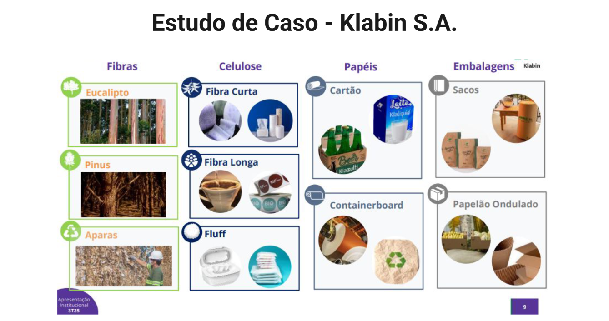

# 📚 Resumo da aula

**Prof. Me. Deivison S. Takatu**

**Data: 13/02/2026**

**Tema da aula: Apresentação da disciplina e contextualização**

---

## Tópicos abordados

- Revisão da conceituação dos termos integração vertical e horizontal
- Estudo de caso da empresa Klabin S.A. e Marfrig S.A.
- Análise da relação entre integração vertical e horizontal com estratégia empresarial

## Conceitos

- **Integração vertical:** Controle sobre os processos internos de uma empresa, em diferentes níveis hierárquicos (conectar linha e logística). Da matéria-prima a distribuição final.
- **Integração horizontal:** Controle sobre os processos externos envolvendo uma empresa, no mesmo nível hierárquico (conectar kdb e tdb). Eliminar concorrentes.

## Estudo de caso - Klabin S.A.

- Suzano e Klabin são empresas donas de terras (por ter matéria-prima)
- Monopólio
- Klabin planta e produz muitas coisas:
  

## Estudo de caso - Marfrig S.A.

- Marfrig é do ramo alimentício
- Comprou concorrentes
