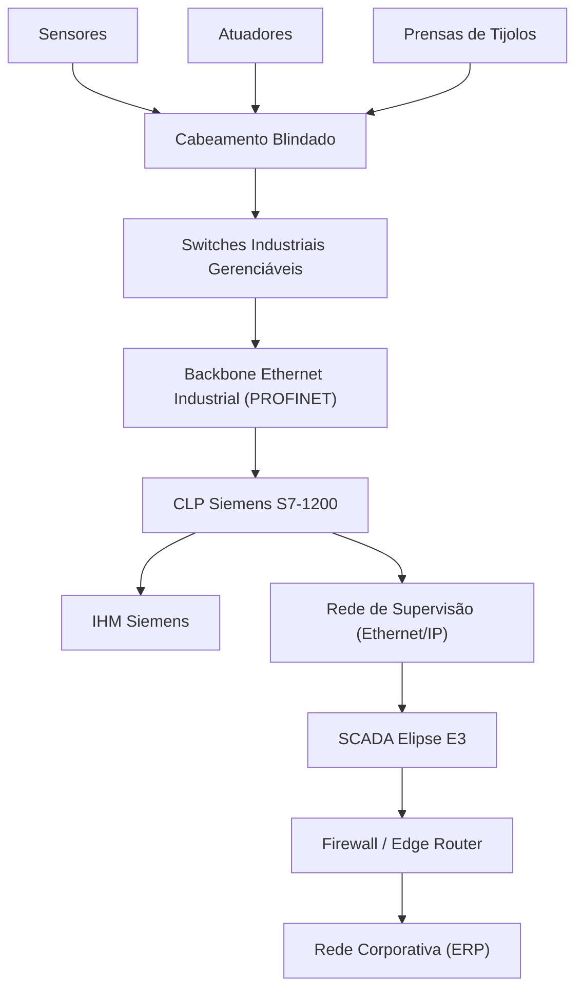

# Implantação de uma rede industrial em uma indústria de tijolos ecológicos

O presente estudo aborda o planejamento e a estruturação de uma infraestrutura de comunicação e automação para uma fábrica de médio porte localizada no município de Sorocaba, no estado de São Paulo. O foco da unidade fabril é a produção de tijolos ecológicos, solução construtiva reconhecida por sua contribuição ambiental e eficiência estrutural. Diferentemente dos tijolos cerâmicos tradicionais, cuja fabricação depende da queima em fornos alimentados por lenha ou combustíveis fósseis, os tijolos ecológicos são produzidos por meio da prensagem e posterior cura de uma mistura composta por solo, cimento e água, eliminando o processo de combustão e, consequentemente, a emissão direta de dióxido de carbono durante a etapa produtiva, conforme destacado por Leroy Merlin (2023) e Revista Tópicos (2022). 

Além da redução do impacto ambiental, os tijolos ecológicos apresentam geometria modular com furos verticais que proporcionam melhor desempenho térmico e acústico às edificações, favorecem a passagem de instalações elétricas e hidráulicas sem necessidade de cortes estruturais e reduzem desperdícios no canteiro de obras, conforme apontado pela Jarfel (2023). Em comparação, os tijolos tradicionais demandam maior consumo energético, apresentam menor racionalização construtiva e geram maior volume de resíduos.

Para que a fábrica alcance elevado padrão de produtividade, rastreabilidade e controle de qualidade, torna-se indispensável a implantação de uma rede industrial capaz de integrar prensas hidráulicas, sensores de umidade, esteiras transportadoras, painéis de comando e sistema corporativo de gestão. Redes domésticas ou comerciais não atendem às exigências desse cenário produtivo, pois são projetadas para tráfego leve de dados, não garantem determinismo de comunicação e não suportam adequadamente ambientes com poeira de cimento, vibrações intensas e interferências eletromagnéticas. Conforme exposto pela Kalatec (2023) e pela Universal Robots (2022), redes industriais são desenvolvidas para operar em tempo real, com alta confiabilidade e robustez física, utilizando cabeamento blindado, conectores industriais e equipamentos com grau de proteção elevado.

No contexto da automação industrial, existem diferentes categorias de redes aplicáveis, como as redes Fieldbus, tradicionalmente utilizadas na comunicação entre dispositivos de campo; redes sem fio industriais, que oferecem flexibilidade operacional; e redes baseadas em Ethernet Industrial, consideradas padrão da Indústria 4.0 por sua alta taxa de transmissão e integração com sistemas corporativos. Entre os principais protocolos destacam-se PROFINET, EtherNet/IP e EtherCAT. Para a planta em Sorocaba, optou-se pela adoção do protocolo PROFINET como backbone da arquitetura proposta, devido à sua capacidade de comunicação determinística em tempo real, elevada velocidade de transmissão e facilidade de integração com redes corporativas convencionais, conforme orientações técnicas apresentadas pela Balluff Brasil (2024).

A implantação dessa infraestrutura requer o atendimento a pré-requisitos técnicos rigorosos, iniciando pelo mapeamento detalhado do layout industrial para definição das rotas de cabeamento segregadas da rede elétrica de potência, conforme boas práticas de projetos elétricos industriais descritas pela CD Consultoria (2023). Também se faz necessária a verificação do sistema de aterramento, a definição de topologia de rede, a especificação de dispositivos compatíveis com o protocolo escolhido e o planejamento da segurança cibernética da rede. O processo de implementação envolve a instalação de eletrocalhas específicas para dados, lançamento de cabos blindados, montagem de painéis de automação com CLPs e switches industriais, configuração lógica dos dispositivos, programação das rotinas de controle e, por fim, a etapa de comissionamento, na qual são realizados testes exaustivos de comunicação e funcionamento antes da entrada em operação.

Para compor essa infraestrutura robusta, realizou-se um levantamento técnico e orçamentário detalhado junto a fornecedores especializados do mercado nacional, garantindo coerência técnica, adequação ao ambiente hostil da fábrica e total escalabilidade para integrações futuras com módulos adicionais de controle. O diagrama a seguir demostra como seria a implementação inicial da solução:

A tabela abaixo consolida a cotação dos equipamentos, suas especificações, fornecedores, quantidades, prazos e custos estimados.

| Equipamento                              | Especificação Técnica                                               | Fornecedor            | Quantidade | Valor Unitário (R$) | Valor Total (R$) | Prazo de Entrega   |
| ---------------------------------------- | ------------------------------------------------------------------- | --------------------- | ------ | ------------------- | ---------------- | ------------------ |
| Controlador Lógico Programável (CLP)     | Siemens SIMATIC S7-1200 CPU 1214C DC/DC/DC, expansível, PROFINET    | Kalatec Automação     | 2      | 3.850,00            | 7.700,00         | 15 dias úteis      |
| Switch Industrial Gerenciável            | Phoenix Contact FL SWITCH 2005, 5 portas RJ45, trilho DIN           | Dimensional Automação | 4      | 2.150,00            | 8.600,00         | 7 dias úteis       |
| IHM (Interface Homem-Máquina)            | Siemens KTP700 Basic, Tela Touch 7 polegadas, PROFINET              | Dimensional Automação | 2      | 4.200,00            | 8.400,00         | 10 dias úteis      |
| Cabeamento de Rede Industrial            | Cabo Lapp Group PROFINET Cat5e, 4 vias, dupla blindagem (Rolo 500m) | Dimensional Automação | 1      | 8.500,00            | 8.500,00         | 5 dias úteis       |
| Sistema Supervisório (SCADA)             | Licença Elipse E3 Server + Studio, 1500 tags                        | Elipse Software       | 1      | 14.300,00           | 14.300,00        | Imediata (Digital) |
| Sensores e Atuadores de Campo            | Conjunto de sensores indutivos e válvulas Festo padrão Ethernet     | Kalatec Automação     | 1      | 12.000,00           | 12.000,00        | 20 dias úteis      |
| **Custo Total Estimado de Equipamentos** |                                                                     |                       |        |                     | **59.500,00**    |                    |

A análise de viabilidade técnica e econômica demonstra que, embora o investimento inicial seja superior ao de uma infraestrutura baseada em equipamentos convencionais de rede, a escolha por dispositivos industriais reduz drasticamente riscos operacionais, evita paradas não programadas e prolonga a vida útil do sistema. Equipamentos domésticos falhariam rapidamente sob vibração constante e exposição ao pó de cimento, gerando custos indiretos elevados com manutenção corretiva e perda de produção. A arquitetura proposta assegura alta disponibilidade, integração direta com o sistema corporativo e possibilidade de expansão futura mediante adição de novos módulos de entrada e saída, novos sensores ou ampliação da capacidade produtiva.

Do ponto de vista de expansão futura, a arquitetura proposta apresenta elevada escalabilidade. O CLP Siemens S7-1200 é expansível por meio de módulos adicionais de entradas e saídas, permitindo a incorporação de novas prensas ou sensores sem necessidade de substituição do controlador principal. O protocolo PROFINET facilita a inclusão de novos dispositivos na rede, mantendo a padronização tecnológica. A estrutura pode evoluir para integração com sistemas de manutenção preditiva, coleta de dados para Business Intelligence, implantação de IIoT (Industrial Internet of Things) e até conexão com plataformas em nuvem para análise avançada de desempenho produtivo. Caso a demanda por tijolos aumente, será possível ampliar linhas de produção com mínima reconfiguração estrutural, aproveitando o backbone já implementado.

Entretanto, existem riscos envolvidos no cenário atual. Entre eles destacam-se riscos técnicos, como falhas de configuração, incompatibilidade de firmware entre dispositivos ou vulnerabilidades de segurança cibernética. Há também riscos operacionais, como interrupção no fornecimento de energia elétrica, que pode afetar tanto a produção quanto os servidores de supervisão. A dependência de conectividade entre chão de fábrica e rede corporativa exige políticas robustas de firewall e segmentação de rede, conforme recomendações de segurança mencionadas pela Balluff Brasil (2024). Além disso, existe o risco de obsolescência tecnológica ao longo dos anos, exigindo planejamento de atualização periódica.

A dependência de fornecedores constitui outro fator estratégico relevante. A solução proposta concentra parte significativa da arquitetura em tecnologias Siemens e Phoenix Contact. Embora essas marcas sejam reconhecidas pela confiabilidade, essa padronização cria dependência técnica para suporte, peças de reposição e atualizações. Oscilações cambiais podem impactar custos de reposição, visto que muitos componentes possuem cadeia de suprimentos internacional. Para mitigar esse risco, recomenda-se contratos de manutenção preventiva, estoque mínimo de peças críticas e treinamento interno da equipe técnica para reduzir dependência externa.

No que se refere à análise de viabilidade econômica e estimativa de retorno do investimento (ROI), considera-se que o investimento inicial de R$ 59.500,00 em equipamentos industriais proporciona ganhos indiretos significativos. A automação permite redução de desperdício de matéria-prima, maior precisão no controle de umidade e prensagem, menor índice de retrabalho e aumento da produtividade diária. Considerando um cenário conservador de aumento de eficiência de 8% a 12% na produção mensal, aliado à redução de paradas não programadas, estima-se que o retorno do investimento possa ocorrer em um período aproximado entre 12 e 24 meses, dependendo do volume produtivo e da margem operacional da fábrica. A economia gerada por menor manutenção corretiva e melhor gestão de estoque contribui diretamente para esse retorno.

Assim, a implantação da rede industrial não deve ser vista apenas como custo tecnológico, mas como investimento estratégico de médio e longo prazo. A integração entre tecnologia da informação e tecnologia operacional fortalece a competitividade da empresa, amplia sua capacidade de expansão, reduz riscos produtivos e posiciona a organização dentro dos princípios da Indústria 4.0, garantindo sustentabilidade ambiental, eficiência energética, redução de desperdícios e melhoria contínua do processo produtivo, consolidando a organização como indústria sustentável, tecnologicamente atualizada e competitiva no cenário nacional.

# Referências

BALLUFF BRASIL. Tipos de redes industriais e suas aplicações. Balluff, 2024. Disponível em: https://balluffbrasil.com.br/rede-industrial-os-componentes-que-voce-deve-conhecer-antes-de-montar-seu-projeto-de-conexao/#:~:text=Implementar%20medidas%20de%20seguran%C3%A7a%20cibern%C3%A9tica%20robustas%20e,s%C3%A3o%20pr%C3%A1ticas%20recomendadas%20para%20melhorar%20a%20seguran%C3%A7a. Acesso em: 22 fev. 2026.

CD CONSULTORIA. Quanto custa um projeto elétrico industrial. Blog CD Consultoria, 2023. Disponível em: https://blog.cdconsultoria.net/instalacoes-hidraulicas-e-eletricas/quanto-custa-um-projeto-eletrico-industrial#:~:text=Assim%2C%20um%20projeto%20el%C3%A9trico%20industrial,a%20R$%2050.000%2C00. Acesso em: 22 fev. 2026.

JARFEL. O revolucionário tijolo ecológico modular. Máquinas Jarfel, 2023. Disponível em: https://www.jarfel.com.br/o-revolucionario-tijolo-ecologico-modular/. Acesso em: 22 fev. 2026.

KALATEC. Redes industriais: o que são e para que servem. Blog Kalatec, 2023. Disponível em: https://blog.kalatec.com.br/redes-industriais/#:~:text=O%20que%20s%C3%A3o%20Redes%20Industriais%20e%20para%20que%20servem?,atividades%20realizadas%20diariamente%20na%20ind%C3%BAstria. Acesso em: 22 fev. 2026.

LEROY MERLIN. Tijolo ecológico: vantagens. Blog Leroy Merlin, 2023. Disponível em: https://blog.leroymerlin.com.br/tijolo-ecologico-vantagens/. Acesso em: 22 fev. 2026.

MERMAID. Flowcharts - Basic Syntax. Docs Mermaid. Disponível em: https://blog.leroymerlin.com.br/tijolo-ecologico-vantagens/](https://mermaid.ai/open-source/syntax/flowchart.html. Acesso em: 22 fev. 2026.

REVISTA TÓPICOS. Tijolo ecológico e os benefícios para o meio ambiente. Revista Tópicos, 2022. Disponível em: https://revistatopicos.com.br/artigos/tijolo-ecologico-e-os-beneficios-para-o-meio-ambiente. Acesso em: 22 fev. 2026.

UNIVERSAL ROBOTS. Redes industriais: o que são, principais tipos e para que servem. Universal Robots Brasil, 2022. Disponível em: https://www.universal-robots.com/br/blog/redes-industriais-o-que-sao-principais-tipos-e-para-que-servem/. Acesso em: 22 fev. 2026.

INDUSTRIAL BRAIN. Tijolo Ecológico: O Guia Completo. Vídeo publicado no YouTube, 2023. Disponível em: https://youtu.be/8QbHyR_r7bY?si=SyhSUO1GyzzGaVbc. Acesso em: 22 fev. 2026.
