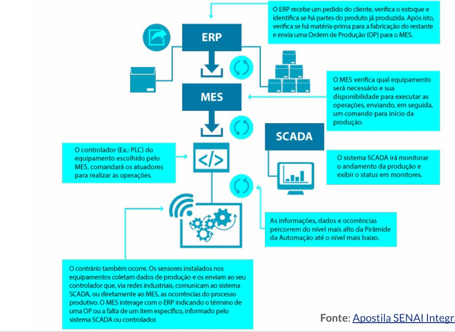
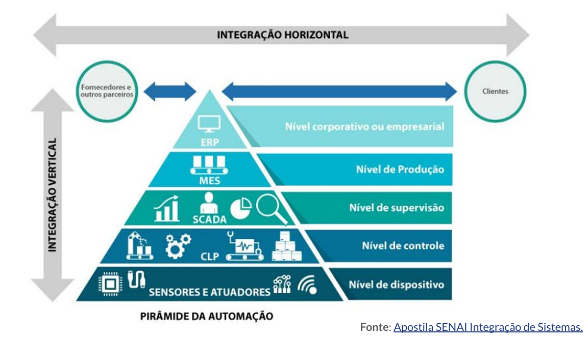

# 📚 Resumo da aula

**Prof. Me. Deivison S. Takatu**

**Data: 10/04/2026**

**Tema da aula: Pirâmide da Automação**

---

## Tópicos abordados

- Conceituação da Pirâmide da Automação
- Função de cada nível hierárquico na integração industrial
- Relação entre os níveis e a integração vertical

## Pirâmide da Automação

- Estrutura hierárquica que organiza os sistemas de automação industrial em cinco níveis
- Níveis inferiores executam o processo, intermediários controlam e monitoram, superiores planejam e decidem
- A integração entre todos os níveis garante que a indústria funcione como um sistema único e conectado

## Níveis da pirâmide

- Nível 1: Sensores e Atuadores — coleta de dados físicos e execução de ações no processo
- Nível 2: Controle — CLP e SDCD realizam processamento em tempo real e tomam decisões automáticas
- Nível 3: Supervisão — SCADA e IHM permitem visualização, interação do operador e registro histórico
- Nível 4: MES — gerencia a produção em tempo real, define recursos e monitora desempenho
- Nível 5: ERP — gestão empresarial e planejamento estratégico da organização

## Observações

- Sem essa estrutura, os sistemas operam de forma isolada e a produção perde eficiência
- A pirâmide materializa o conceito de integração vertical: dados fluem do chão de fábrica até a gestão estratégica

